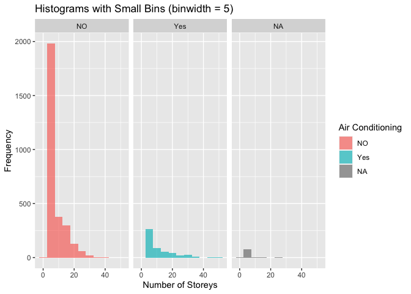
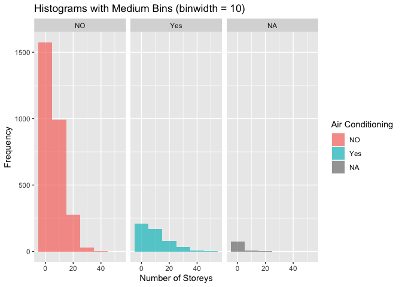
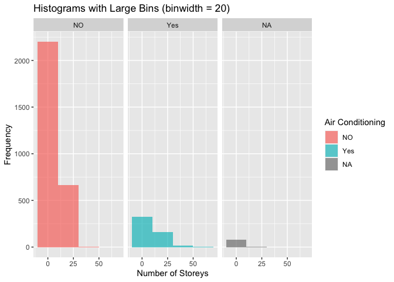
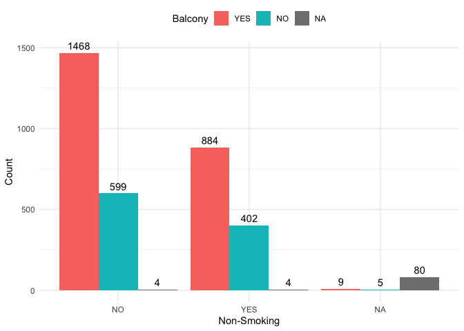
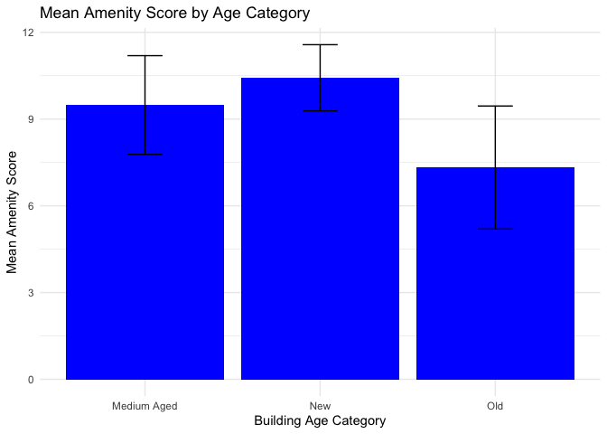
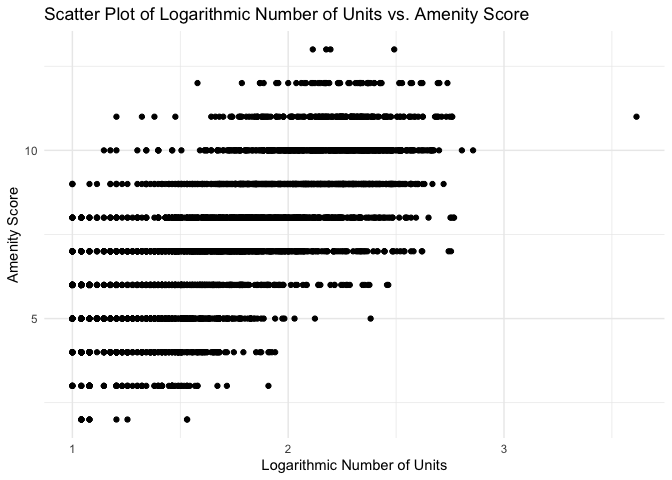

Mini Data Analysis Milestone 2
================

*To complete this milestone, you can either edit [this `.rmd`
file](https://raw.githubusercontent.com/UBC-STAT/stat545.stat.ubc.ca/master/content/mini-project/mini-project-2.Rmd)
directly. Fill in the sections that are commented out with
`<!--- start your work here--->`. When you are done, make sure to knit
to an `.md` file by changing the output in the YAML header to
`github_document`, before submitting a tagged release on canvas.*

# Welcome to the rest of your mini data analysis project!

In Milestone 1, you explored your data. and came up with research
questions. This time, we will finish up our mini data analysis and
obtain results for your data by:

-   Making summary tables and graphs
-   Manipulating special data types in R: factors and/or dates and
    times.
-   Fitting a model object to your data, and extract a result.
-   Reading and writing data as separate files.

We will also explore more in depth the concept of *tidy data.*

**NOTE**: The main purpose of the mini data analysis is to integrate
what you learn in class in an analysis. Although each milestone provides
a framework for you to conduct your analysis, it’s possible that you
might find the instructions too rigid for your data set. If this is the
case, you may deviate from the instructions – just make sure you’re
demonstrating a wide range of tools and techniques taught in this class.

# Instructions

**To complete this milestone**, edit [this very `.Rmd`
file](https://raw.githubusercontent.com/UBC-STAT/stat545.stat.ubc.ca/master/content/mini-project/mini-project-2.Rmd)
directly. Fill in the sections that are tagged with
`<!--- start your work here--->`.

**To submit this milestone**, make sure to knit this `.Rmd` file to an
`.md` file by changing the YAML output settings from
`output: html_document` to `output: github_document`. Commit and push
all of your work to your mini-analysis GitHub repository, and tag a
release on GitHub. Then, submit a link to your tagged release on canvas.

**Points**: This milestone is worth 50 points: 45 for your analysis, and
5 for overall reproducibility, cleanliness, and coherence of the Github
submission.

**Research Questions**: In Milestone 1, you chose two research questions
to focus on. Wherever realistic, your work in this milestone should
relate to these research questions whenever we ask for justification
behind your work. In the case that some tasks in this milestone don’t
align well with one of your research questions, feel free to discuss
your results in the context of a different research question.

# Learning Objectives

By the end of this milestone, you should:

-   Understand what *tidy* data is, and how to create it using `tidyr`.
-   Generate a reproducible and clear report using R Markdown.
-   Manipulating special data types in R: factors and/or dates and
    times.
-   Fitting a model object to your data, and extract a result.
-   Reading and writing data as separate files.

# Setup

Begin by loading your data and the tidyverse package below:

``` r
library(datateachr) # <- might contain the data you picked!
library(tidyverse)
```

# Task 1: Process and summarize your data

From milestone 1, you should have an idea of the basic structure of your
dataset (e.g. number of rows and columns, class types, etc.). Here, we
will start investigating your data more in-depth using various data
manipulation functions.

### 1.1 (1 point)

First, write out the 4 research questions you defined in milestone 1
were. This will guide your work through milestone 2:

<!-------------------------- Start your work below ---------------------------->

1.  Is there a relationship between the number of storeys in apartment
    buildings and the presence of air conditioning?
2.  Is having a balcony correlated with an apartment building being
    non-smoking or not?
3.  Can we identify any patterns in the amenities offered by apartment
    buildings based on their age?
4.  Do apartment buildings with more amenities tend to have a higher
    number of units?

<!----------------------------------------------------------------------------->

Here, we will investigate your data using various data manipulation and
graphing functions.

### 1.2 (8 points)

Now, for each of your four research questions, choose one task from
options 1-4 (summarizing), and one other task from 4-8 (graphing). You
should have 2 tasks done for each research question (8 total). Make sure
it makes sense to do them! (e.g. don’t use a numerical variables for a
task that needs a categorical variable.). Comment on why each task helps
(or doesn’t!) answer the corresponding research question.

Ensure that the output of each operation is printed!

Also make sure that you’re using dplyr and ggplot2 rather than base R.
Outside of this project, you may find that you prefer using base R
functions for certain tasks, and that’s just fine! But part of this
project is for you to practice the tools we learned in class, which is
dplyr and ggplot2.

**Summarizing:**

1.  Compute the *range*, *mean*, and *two other summary statistics* of
    **one numerical variable** across the groups of **one categorical
    variable** from your data.
2.  Compute the number of observations for at least one of your
    categorical variables. Do not use the function `table()`!
3.  Create a categorical variable with 3 or more groups from an existing
    numerical variable. You can use this new variable in the other
    tasks! *An example: age in years into “child, teen, adult, senior”.*
4.  Compute the proportion and counts in each category of one
    categorical variable across the groups of another categorical
    variable from your data. Do not use the function `table()`!

**Graphing:**

6.  Create a graph of your choosing, make one of the axes logarithmic,
    and format the axes labels so that they are “pretty” or easier to
    read.
7.  Make a graph where it makes sense to customize the alpha
    transparency.

Using variables and/or tables you made in one of the “Summarizing”
tasks:

8.  Create a graph that has at least two geom layers.
9.  Create 3 histograms, with each histogram having different sized
    bins. Pick the “best” one and explain why it is the best.

Make sure it’s clear what research question you are doing each operation
for!

<!------------------------- Start your work below ----------------------------->

``` r
#Q1- Is there a relationship between the number of storeys in apartment buildings and the presence of air conditioning?

#PART1 Summarizing: Here I'm going to compare the range, mean and maximum and minimum number of building storeys among buildings with and without air conditioning.

# Create a new categorical variable
apt_buildings <- apt_buildings %>%
  mutate(air_conditioning_group = case_when(
    air_conditioning %in% c("CENTRAL AIR", "INDIVIDUAL UNITS") ~ "Yes",
    air_conditioning == "NONE" ~ "NO",
    TRUE ~ as.character(air_conditioning)
  ))

# Calculate summary statistics for the new "Yes" and "No" categories
summary_data <- apt_buildings %>%
  group_by(air_conditioning_group) %>%
  summarise(
    mean_storeys = mean(no_of_storeys, na.rm = TRUE),
    min_storeys = min(no_of_storeys, na.rm = TRUE),
    max_storeys = max(no_of_storeys, na.rm = TRUE),
    range_storeys = max_storeys - min_storeys
  )

# Display the summary statistics in a tibble
print(summary_data)
```

    ## # A tibble: 3 × 5
    ##   air_conditioning_group mean_storeys min_storeys max_storeys range_storeys
    ##   <chr>                         <dbl>       <dbl>       <dbl>         <dbl>
    ## 1 NO                             7.37           0          41            41
    ## 2 Yes                           10.5            3          51            48
    ## 3 <NA>                           4.12           0          23            23

``` r
#PART2 Graphing :Here I have created three different histograms Showing the frequency of apartments with various number of storeys, separated based on If they have air-conditioning or not. In my opinion, the histogram with medium bins (bandwidth=10), as it does not emphasize or minimize a certain number of storeys as seen in the "small bin" and "large bin" histograms and provides a clearer picture of the general distribution of the data. this can help identify central tendencies without getting lost in details.

# Create a histogram with small bins and facet by air conditioning status
ggplot(apt_buildings, aes(x = no_of_storeys, fill = air_conditioning_group)) +
  geom_histogram(binwidth = 5, position = "dodge", alpha = 0.7) +
  labs(
    x = "Number of Storeys",
    y = "Frequency",
    title = "Histograms with Small Bins (binwidth = 5)",
    fill = "Air Conditioning"
  ) +
  facet_grid(. ~ air_conditioning_group)
```

<!-- -->

``` r
# Create a histogram with medium bins and facet by air conditioning status
ggplot(apt_buildings, aes(x = no_of_storeys, fill = air_conditioning_group)) +
  geom_histogram(binwidth = 10, position = "dodge", alpha = 0.7) +
  labs(
    x = "Number of Storeys",
    y = "Frequency",
    title = "Histograms with Medium Bins (binwidth = 10)",
    fill = "Air Conditioning"
  ) +
  facet_grid(. ~ air_conditioning_group)
```

<!-- -->

``` r
# Create a histogram with large bins and facet by air conditioning status
ggplot(apt_buildings, aes(x = no_of_storeys, fill = air_conditioning_group)) +
  geom_histogram(binwidth = 20, position = "dodge", alpha = 0.7) +
  labs(
    x = "Number of Storeys",
    y = "Frequency",
    title = "Histograms with Large Bins (binwidth = 20)",
    fill = "Air Conditioning"
  ) +
  facet_grid(. ~ air_conditioning_group)
```

<!-- -->

``` r
#Q2: Is having a balcony correlated with an apartment building being non-smoking or not?

#PART1 Summarizing: Computing the proportion and counts of having a balcony across the groups of being non-smoking or not.

# Convert 'balconies' column to a factor with specific levels
apt_buildings$balconies <- factor(apt_buildings$balconies, levels = c("YES", "NO"))

# Filter the data into two groups: non-smoking and smoking
non_smoking_group <- apt_buildings %>% filter(`non-smoking_building` == "YES")
smoking_group <- apt_buildings %>% filter(`non-smoking_building` == "NO")

# Calculate counts for properties with and without balconies in each group
non_smoking_balcony_count <- sum(non_smoking_group$balconies == "YES", na.rm = TRUE)
non_smoking_no_balcony_count <- sum(non_smoking_group$balconies == "NO", na.rm = TRUE)
non_smoking_total_count <- nrow(non_smoking_group)

smoking_balcony_count <- sum(smoking_group$balconies == "YES", na.rm = TRUE)
smoking_no_balcony_count <- sum(smoking_group$balconies == "NO", na.rm = TRUE)
smoking_total_count <- nrow(smoking_group)

# Calculate total counts and proportions
total_balcony_count <- non_smoking_balcony_count + smoking_balcony_count
total_no_balcony_count <- non_smoking_no_balcony_count + smoking_no_balcony_count
total_total_count <- non_smoking_total_count + smoking_total_count

# Create a tibble to store the results
results_tibble <- tibble(
  Group = c("Non-Smoking", "Smoking", "Total"),
  Count_With_Balcony = c(non_smoking_balcony_count, smoking_balcony_count, total_balcony_count),
  Count_Without_Balcony = c(non_smoking_no_balcony_count, smoking_no_balcony_count, total_no_balcony_count),
  Total_Count = c(non_smoking_total_count, smoking_total_count, total_total_count),
  Proportion_With_Balcony = c(non_smoking_balcony_count / non_smoking_total_count,
                             smoking_balcony_count / smoking_total_count, NA)
)

# Print 
print(results_tibble)
```

    ## # A tibble: 3 × 5
    ##   Group       Count_With_Balcony Count_Without_Balcony Total_Count
    ##   <chr>                    <int>                 <int>       <int>
    ## 1 Non-Smoking                884                   402        1290
    ## 2 Smoking                   1468                   599        2071
    ## 3 Total                     2352                  1001        3361
    ## # ℹ 1 more variable: Proportion_With_Balcony <dbl>

``` r
#PART2 Graphing: This graph visualizes the count of properties with and without balconies for both non-smoking and smoking groups. There are two geom layers: The first  creates the bars representing the counts. The second layer adds text labels to the top of the bars to display the count for each category.

# Create a data frame to calculate counts
data_summary <- apt_buildings %>%
  group_by(`non-smoking_building`, balconies) %>%
  summarize(count = n())
```

    ## `summarise()` has grouped output by 'non-smoking_building'. You can override
    ## using the `.groups` argument.

``` r
# Create the graph with two geom layers
ggplot(data_summary, aes(x = `non-smoking_building`, y = count, fill = balconies)) +
  geom_bar(stat = "identity", position = "dodge") +
  geom_text(aes(label = count), position = position_dodge(width = 0.9), vjust = -0.5) +
  labs(
    x = "Non-Smoking",
    y = "Count",
    fill = "Balcony"
  ) +
  theme_minimal() +
  theme(legend.position = "top")
```

<!-- -->

``` r
#Q3: Can we identify any patterns in the amenities offered by apartment buildings based on their age?
#PART1 Summarizing: I created two new variables. First one creating an amenity score, based on a set of amenities that each building could have. Second, a variable categorizing the buildings into new, medium aged, and old. That is by dividing the data set into 3 parts newer than 10, 11-30, and older than 30 years of age. This would help me to answer the current question easier.

# List of amenities to consider
amenities_to_count <- c(
  "air_conditioning_group",
  "balconies",
  "barrier_free_accessibilty_entr",
  "exterior_fire_escape",
  "fire_alarm",
  "garbage_chutes",
  "intercom",
  "laundry_room",
  "locker_or_storage_room",
  "pets_allowed",
  "sprinkler_system",
  "cooling_room",
  "emergency_power"
)

# Convert the = variables to factor
apt_buildings <- apt_buildings %>%
  mutate(across(all_of(amenities_to_count), as.factor))

# Calculate the Amenity Score for each apartment
apt_buildings <- apt_buildings %>%
  mutate(Amenity_Score = rowSums(select(., all_of(amenities_to_count)) != "NO"))

# View 
head(apt_buildings)
```

    ## # A tibble: 6 × 39
    ##      id air_conditioning amenities balconies barrier_free_accessi…¹ bike_parking
    ##   <dbl> <chr>            <chr>     <fct>     <fct>                  <chr>       
    ## 1 10359 NONE             Outdoor … YES       YES                    0 indoor pa…
    ## 2 10360 NONE             Outdoor … YES       NO                     0 indoor pa…
    ## 3 10361 NONE             <NA>      YES       NO                     Not Availab…
    ## 4 10362 NONE             <NA>      YES       YES                    Not Availab…
    ## 5 10363 NONE             <NA>      NO        NO                     12 indoor p…
    ## 6 10364 NONE             <NA>      NO        NO                     Not Availab…
    ## # ℹ abbreviated name: ¹​barrier_free_accessibilty_entr
    ## # ℹ 33 more variables: exterior_fire_escape <fct>, fire_alarm <fct>,
    ## #   garbage_chutes <fct>, heating_type <chr>, intercom <fct>,
    ## #   laundry_room <fct>, locker_or_storage_room <fct>, no_of_elevators <dbl>,
    ## #   parking_type <chr>, pets_allowed <fct>, prop_management_company_name <chr>,
    ## #   property_type <chr>, rsn <dbl>, separate_gas_meters <chr>,
    ## #   separate_hydro_meters <chr>, separate_water_meters <chr>, …

``` r
#New variable based on age.
# Calculate building age
apt_buildings <- apt_buildings %>%
  mutate(Building_Age = 2023 - year_built)

# Categorize building age into new, medium-aged, and old buildings
apt_buildings <- apt_buildings %>%
  mutate(Building_Age_Category = case_when(
    Building_Age <= 10 ~ "New",
    Building_Age <= 30 ~ "Medium Aged",
    TRUE ~ "Old"
  ))
head(apt_buildings)
```

    ## # A tibble: 6 × 41
    ##      id air_conditioning amenities balconies barrier_free_accessi…¹ bike_parking
    ##   <dbl> <chr>            <chr>     <fct>     <fct>                  <chr>       
    ## 1 10359 NONE             Outdoor … YES       YES                    0 indoor pa…
    ## 2 10360 NONE             Outdoor … YES       NO                     0 indoor pa…
    ## 3 10361 NONE             <NA>      YES       NO                     Not Availab…
    ## 4 10362 NONE             <NA>      YES       YES                    Not Availab…
    ## 5 10363 NONE             <NA>      NO        NO                     12 indoor p…
    ## 6 10364 NONE             <NA>      NO        NO                     Not Availab…
    ## # ℹ abbreviated name: ¹​barrier_free_accessibilty_entr
    ## # ℹ 35 more variables: exterior_fire_escape <fct>, fire_alarm <fct>,
    ## #   garbage_chutes <fct>, heating_type <chr>, intercom <fct>,
    ## #   laundry_room <fct>, locker_or_storage_room <fct>, no_of_elevators <dbl>,
    ## #   parking_type <chr>, pets_allowed <fct>, prop_management_company_name <chr>,
    ## #   property_type <chr>, rsn <dbl>, separate_gas_meters <chr>,
    ## #   separate_hydro_meters <chr>, separate_water_meters <chr>, …

``` r
#PART2 Graphing: In this section we graph the amenity score categorized by each age group, with the addition of display error bars as an additional layer for each of the categories.

# Calculate the mean amenity score for each age category
mean_amenity_by_age <- apt_buildings %>%
  group_by(Building_Age_Category) %>%
  summarize(
    Mean_Amenity_Score = mean(Amenity_Score, na.rm = TRUE),
    StdDev_Amenity_Score = sd(Amenity_Score, na.rm = TRUE)
  )

# Create a bar plot with 2 geom layers
ggplot(mean_amenity_by_age, aes(x = Building_Age_Category, y = Mean_Amenity_Score)) +
  geom_bar(stat = "identity", fill = "blue") +
  geom_errorbar(
    aes(ymin = Mean_Amenity_Score - StdDev_Amenity_Score, ymax = Mean_Amenity_Score + StdDev_Amenity_Score),
    width = 0.2,
    position = position_dodge(width = 0.7)
  ) +
  labs(
    title = "Mean Amenity Score by Age Category",
    x = "Building Age Category",
    y = "Mean Amenity Score"
  ) +
  theme_minimal()
```

<!-- -->

``` r
#Q4: Do apartment buildings with more amenities tend to have a higher number of units?

#PART1 Summarizing: 
# Categorize Amenity Score into low, medium, and high number of amenities buildings
apt_buildings <- apt_buildings %>%
  mutate(Amenity_Score_Category = case_when(
    Amenity_Score <= 6 ~ "Low Amenities",
    Building_Age <= 8 ~ "Medium Amenities",
    TRUE ~ "Many Amenities"
  ))


# Calculate summary  for number of units based on number of amenity categories
summary_data <- apt_buildings %>%
  group_by(Amenity_Score_Category) %>%
  summarise(
    mean_units = mean(no_of_units, na.rm = TRUE),
    min_units = min(no_of_units, na.rm = TRUE),
    max_units = max(no_of_units, na.rm = TRUE),
    range_units = max_units - min_units
  )

print(summary_data)
```

    ## # A tibble: 3 × 5
    ##   Amenity_Score_Category mean_units min_units max_units range_units
    ##   <chr>                       <dbl>     <dbl>     <dbl>       <dbl>
    ## 1 Low Amenities                31.1        10       291         281
    ## 2 Many Amenities              117.          0       719         719
    ## 3 Medium Amenities            348.         20      4111        4091

``` r
#PART2 Graphing: 

apt_buildings %>%
  ggplot(aes(x = log10(no_of_units), y = Amenity_Score)) +
  geom_point() +
  labs(
    title = "Scatter Plot of Logarithmic Number of Units vs. Amenity Score",
    x = "Logarithmic Number of Units",
    y = "Amenity Score"
  ) +
  theme_minimal()
```

    ## Warning: Removed 120 rows containing missing values (`geom_point()`).

<!-- -->

<!----------------------------------------------------------------------------->

### 1.3 (2 points)

Based on the operations that you’ve completed, how much closer are you
to answering your research questions? Think about what aspects of your
research questions remain unclear. Can your research questions be
refined, now that you’ve investigated your data a bit more? Which
research questions are yielding interesting results?

<!------------------------- Write your answer here ---------------------------->

Based on my current findings, I am closer to answering all four of my
research questions,considering that I have observed correlations for all
the initial hypotheses I had. Although, more refinements can be made on
each question, the current setup seems to have been adequate in getting
answers. Questions three and four are the most interesting. As graphs
from Q3 show that the newer builds of apartments do in fact have more
amenities, proving we are continuously seeking more comfort and Q4
shows, as the number of occupants is increased in each building, we see
a trend of increased amenities, making it more accessible to everyone.

<!----------------------------------------------------------------------------->

# Task 2: Tidy your data

In this task, we will do several exercises to reshape our data. The goal
here is to understand how to do this reshaping with the `tidyr` package.

A reminder of the definition of *tidy* data:

-   Each row is an **observation**
-   Each column is a **variable**
-   Each cell is a **value**

### 2.1 (2 points)

Based on the definition above, can you identify if your data is tidy or
untidy? Go through all your columns, or if you have \>8 variables, just
pick 8, and explain whether the data is untidy or tidy.

<!--------------------------- Start your work below --------------------------->

The database I am working with is Apartment Buildings, with regards to
the observations in the dataset, this data is tidy. Here I will explore
8 of the variables.

id: This column represents unique identification numbers for each of the
apartments. air_conditioning: This column shows the type of
air-conditioning each apartment may have, this variable is stored as a
factor. amenities: The column names the type of amenity each apartment
may have, stored as characters. balcony, exterior_fire_escape,
fire_alarm, garbage_chutes and intercom: these variables are binary
variables, saved as factor, and assess the availability of a certain
amenity in the apartment.

<!----------------------------------------------------------------------------->

### 2.2 (4 points)

Now, if your data is tidy, untidy it! Then, tidy it back to it’s
original state.

If your data is untidy, then tidy it! Then, untidy it back to it’s
original state.

Be sure to explain your reasoning for this task. Show us the “before”
and “after”.

<!--------------------------- Start your work below --------------------------->

``` r
#Before Un-Tidying
glimpse(apt_buildings)
```

    ## Rows: 3,455
    ## Columns: 42
    ## $ id                               <dbl> 10359, 10360, 10361, 10362, 10363, 10…
    ## $ air_conditioning                 <chr> "NONE", "NONE", "NONE", "NONE", "NONE…
    ## $ amenities                        <chr> "Outdoor rec facilities", "Outdoor po…
    ## $ balconies                        <fct> YES, YES, YES, YES, NO, NO, NO, YES, …
    ## $ barrier_free_accessibilty_entr   <fct> YES, NO, NO, YES, NO, NO, YES, NO, YE…
    ## $ bike_parking                     <chr> "0 indoor parking spots and 10 outdoo…
    ## $ exterior_fire_escape             <fct> NO, NO, NO, YES, NO, NA, NO, NO, NO, …
    ## $ fire_alarm                       <fct> YES, YES, YES, YES, YES, YES, YES, YE…
    ## $ garbage_chutes                   <fct> YES, YES, NO, NO, NO, NO, NO, YES, YE…
    ## $ heating_type                     <chr> "HOT WATER", "HOT WATER", "HOT WATER"…
    ## $ intercom                         <fct> YES, YES, YES, YES, YES, YES, YES, YE…
    ## $ laundry_room                     <fct> YES, YES, YES, YES, YES, YES, YES, YE…
    ## $ locker_or_storage_room           <fct> NO, YES, YES, YES, NO, YES, YES, YES,…
    ## $ no_of_elevators                  <dbl> 3, 3, 0, 1, 0, 0, 0, 2, 4, 2, 0, 2, 2…
    ## $ parking_type                     <chr> "Underground Garage , Garage accessib…
    ## $ pets_allowed                     <fct> YES, YES, YES, YES, YES, YES, YES, YE…
    ## $ prop_management_company_name     <chr> NA, "SCHICKEDANZ BROS. PROPERTIES", N…
    ## $ property_type                    <chr> "PRIVATE", "PRIVATE", "PRIVATE", "PRI…
    ## $ rsn                              <dbl> 4154812, 4154815, 4155295, 4155309, 4…
    ## $ separate_gas_meters              <chr> "NO", "NO", "NO", "NO", "NO", "NO", "…
    ## $ separate_hydro_meters            <chr> "YES", "YES", "YES", "YES", "YES", "Y…
    ## $ separate_water_meters            <chr> "NO", "NO", "NO", "NO", "NO", "NO", "…
    ## $ site_address                     <chr> "65  FOREST MANOR RD", "70  CLIPPER R…
    ## $ sprinkler_system                 <fct> YES, YES, NO, YES, NO, NO, NO, YES, Y…
    ## $ visitor_parking                  <chr> "PAID", "FREE", "UNAVAILABLE", "UNAVA…
    ## $ ward                             <chr> "17", "17", "03", "03", "02", "02", "…
    ## $ window_type                      <chr> "DOUBLE PANE", "DOUBLE PANE", "DOUBLE…
    ## $ year_built                       <dbl> 1967, 1970, 1927, 1959, 1943, 1952, 1…
    ## $ year_registered                  <dbl> 2017, 2017, 2017, 2017, 2017, NA, 201…
    ## $ no_of_storeys                    <dbl> 17, 14, 4, 5, 4, 4, 4, 7, 32, 4, 4, 7…
    ## $ emergency_power                  <fct> NO, YES, NO, NO, NO, NO, NO, YES, NO,…
    ## $ `non-smoking_building`           <chr> "YES", "NO", "YES", "YES", "YES", "NO…
    ## $ no_of_units                      <dbl> 218, 206, 34, 42, 25, 34, 14, 105, 57…
    ## $ no_of_accessible_parking_spaces  <dbl> 8, 10, 20, 42, 12, 0, 5, 1, 1, 6, 12,…
    ## $ facilities_available             <chr> "Recycling bins", "Green Bin / Organi…
    ## $ cooling_room                     <fct> NO, NO, NO, NO, NO, NO, NO, NO, NO, N…
    ## $ no_barrier_free_accessible_units <dbl> 2, 0, 0, 42, 0, NA, 14, 0, 0, 1, 25, …
    ## $ air_conditioning_group           <fct> NO, NO, NO, NO, NO, NO, NO, Yes, NO, …
    ## $ Amenity_Score                    <dbl> 8, 9, 6, 9, 4, NA, 6, 10, 8, 8, 7, 7,…
    ## $ Building_Age                     <dbl> 56, 53, 96, 64, 80, 71, 64, 52, 54, 5…
    ## $ Building_Age_Category            <chr> "Old", "Old", "Old", "Old", "Old", "O…
    ## $ Amenity_Score_Category           <chr> "Many Amenities", "Many Amenities", "…

``` r
#To untidy this tidy data, I have used the pivot_longer function to split the air_conditioning column into 2 columns, each stating information about the air_conditioning, but one with the variable name , and the other with the ones just with the AC type. Making one variable shown in two columns.

#After Un-Tidying
apt_buildings_ut <- pivot_longer(apt_buildings, 
                       cols = air_conditioning,  
                       names_to = "air_conditioning_row",  
                       values_to = "air_conditioning_value",
                       
)

 
glimpse(apt_buildings_ut)
```

    ## Rows: 3,455
    ## Columns: 43
    ## $ id                               <dbl> 10359, 10360, 10361, 10362, 10363, 10…
    ## $ amenities                        <chr> "Outdoor rec facilities", "Outdoor po…
    ## $ balconies                        <fct> YES, YES, YES, YES, NO, NO, NO, YES, …
    ## $ barrier_free_accessibilty_entr   <fct> YES, NO, NO, YES, NO, NO, YES, NO, YE…
    ## $ bike_parking                     <chr> "0 indoor parking spots and 10 outdoo…
    ## $ exterior_fire_escape             <fct> NO, NO, NO, YES, NO, NA, NO, NO, NO, …
    ## $ fire_alarm                       <fct> YES, YES, YES, YES, YES, YES, YES, YE…
    ## $ garbage_chutes                   <fct> YES, YES, NO, NO, NO, NO, NO, YES, YE…
    ## $ heating_type                     <chr> "HOT WATER", "HOT WATER", "HOT WATER"…
    ## $ intercom                         <fct> YES, YES, YES, YES, YES, YES, YES, YE…
    ## $ laundry_room                     <fct> YES, YES, YES, YES, YES, YES, YES, YE…
    ## $ locker_or_storage_room           <fct> NO, YES, YES, YES, NO, YES, YES, YES,…
    ## $ no_of_elevators                  <dbl> 3, 3, 0, 1, 0, 0, 0, 2, 4, 2, 0, 2, 2…
    ## $ parking_type                     <chr> "Underground Garage , Garage accessib…
    ## $ pets_allowed                     <fct> YES, YES, YES, YES, YES, YES, YES, YE…
    ## $ prop_management_company_name     <chr> NA, "SCHICKEDANZ BROS. PROPERTIES", N…
    ## $ property_type                    <chr> "PRIVATE", "PRIVATE", "PRIVATE", "PRI…
    ## $ rsn                              <dbl> 4154812, 4154815, 4155295, 4155309, 4…
    ## $ separate_gas_meters              <chr> "NO", "NO", "NO", "NO", "NO", "NO", "…
    ## $ separate_hydro_meters            <chr> "YES", "YES", "YES", "YES", "YES", "Y…
    ## $ separate_water_meters            <chr> "NO", "NO", "NO", "NO", "NO", "NO", "…
    ## $ site_address                     <chr> "65  FOREST MANOR RD", "70  CLIPPER R…
    ## $ sprinkler_system                 <fct> YES, YES, NO, YES, NO, NO, NO, YES, Y…
    ## $ visitor_parking                  <chr> "PAID", "FREE", "UNAVAILABLE", "UNAVA…
    ## $ ward                             <chr> "17", "17", "03", "03", "02", "02", "…
    ## $ window_type                      <chr> "DOUBLE PANE", "DOUBLE PANE", "DOUBLE…
    ## $ year_built                       <dbl> 1967, 1970, 1927, 1959, 1943, 1952, 1…
    ## $ year_registered                  <dbl> 2017, 2017, 2017, 2017, 2017, NA, 201…
    ## $ no_of_storeys                    <dbl> 17, 14, 4, 5, 4, 4, 4, 7, 32, 4, 4, 7…
    ## $ emergency_power                  <fct> NO, YES, NO, NO, NO, NO, NO, YES, NO,…
    ## $ `non-smoking_building`           <chr> "YES", "NO", "YES", "YES", "YES", "NO…
    ## $ no_of_units                      <dbl> 218, 206, 34, 42, 25, 34, 14, 105, 57…
    ## $ no_of_accessible_parking_spaces  <dbl> 8, 10, 20, 42, 12, 0, 5, 1, 1, 6, 12,…
    ## $ facilities_available             <chr> "Recycling bins", "Green Bin / Organi…
    ## $ cooling_room                     <fct> NO, NO, NO, NO, NO, NO, NO, NO, NO, N…
    ## $ no_barrier_free_accessible_units <dbl> 2, 0, 0, 42, 0, NA, 14, 0, 0, 1, 25, …
    ## $ air_conditioning_group           <fct> NO, NO, NO, NO, NO, NO, NO, Yes, NO, …
    ## $ Amenity_Score                    <dbl> 8, 9, 6, 9, 4, NA, 6, 10, 8, 8, 7, 7,…
    ## $ Building_Age                     <dbl> 56, 53, 96, 64, 80, 71, 64, 52, 54, 5…
    ## $ Building_Age_Category            <chr> "Old", "Old", "Old", "Old", "Old", "O…
    ## $ Amenity_Score_Category           <chr> "Many Amenities", "Many Amenities", "…
    ## $ air_conditioning_row             <chr> "air_conditioning", "air_conditioning…
    ## $ air_conditioning_value           <chr> "NONE", "NONE", "NONE", "NONE", "NONE…

``` r
# pivot_wider to revert to the original state
apt_buildings_t <- pivot_wider(apt_buildings_ut,
                           names_from = "air_conditioning_row",  
                           values_from = "air_conditioning_value"  
)


glimpse(apt_buildings_t)
```

    ## Rows: 3,455
    ## Columns: 42
    ## $ id                               <dbl> 10359, 10360, 10361, 10362, 10363, 10…
    ## $ amenities                        <chr> "Outdoor rec facilities", "Outdoor po…
    ## $ balconies                        <fct> YES, YES, YES, YES, NO, NO, NO, YES, …
    ## $ barrier_free_accessibilty_entr   <fct> YES, NO, NO, YES, NO, NO, YES, NO, YE…
    ## $ bike_parking                     <chr> "0 indoor parking spots and 10 outdoo…
    ## $ exterior_fire_escape             <fct> NO, NO, NO, YES, NO, NA, NO, NO, NO, …
    ## $ fire_alarm                       <fct> YES, YES, YES, YES, YES, YES, YES, YE…
    ## $ garbage_chutes                   <fct> YES, YES, NO, NO, NO, NO, NO, YES, YE…
    ## $ heating_type                     <chr> "HOT WATER", "HOT WATER", "HOT WATER"…
    ## $ intercom                         <fct> YES, YES, YES, YES, YES, YES, YES, YE…
    ## $ laundry_room                     <fct> YES, YES, YES, YES, YES, YES, YES, YE…
    ## $ locker_or_storage_room           <fct> NO, YES, YES, YES, NO, YES, YES, YES,…
    ## $ no_of_elevators                  <dbl> 3, 3, 0, 1, 0, 0, 0, 2, 4, 2, 0, 2, 2…
    ## $ parking_type                     <chr> "Underground Garage , Garage accessib…
    ## $ pets_allowed                     <fct> YES, YES, YES, YES, YES, YES, YES, YE…
    ## $ prop_management_company_name     <chr> NA, "SCHICKEDANZ BROS. PROPERTIES", N…
    ## $ property_type                    <chr> "PRIVATE", "PRIVATE", "PRIVATE", "PRI…
    ## $ rsn                              <dbl> 4154812, 4154815, 4155295, 4155309, 4…
    ## $ separate_gas_meters              <chr> "NO", "NO", "NO", "NO", "NO", "NO", "…
    ## $ separate_hydro_meters            <chr> "YES", "YES", "YES", "YES", "YES", "Y…
    ## $ separate_water_meters            <chr> "NO", "NO", "NO", "NO", "NO", "NO", "…
    ## $ site_address                     <chr> "65  FOREST MANOR RD", "70  CLIPPER R…
    ## $ sprinkler_system                 <fct> YES, YES, NO, YES, NO, NO, NO, YES, Y…
    ## $ visitor_parking                  <chr> "PAID", "FREE", "UNAVAILABLE", "UNAVA…
    ## $ ward                             <chr> "17", "17", "03", "03", "02", "02", "…
    ## $ window_type                      <chr> "DOUBLE PANE", "DOUBLE PANE", "DOUBLE…
    ## $ year_built                       <dbl> 1967, 1970, 1927, 1959, 1943, 1952, 1…
    ## $ year_registered                  <dbl> 2017, 2017, 2017, 2017, 2017, NA, 201…
    ## $ no_of_storeys                    <dbl> 17, 14, 4, 5, 4, 4, 4, 7, 32, 4, 4, 7…
    ## $ emergency_power                  <fct> NO, YES, NO, NO, NO, NO, NO, YES, NO,…
    ## $ `non-smoking_building`           <chr> "YES", "NO", "YES", "YES", "YES", "NO…
    ## $ no_of_units                      <dbl> 218, 206, 34, 42, 25, 34, 14, 105, 57…
    ## $ no_of_accessible_parking_spaces  <dbl> 8, 10, 20, 42, 12, 0, 5, 1, 1, 6, 12,…
    ## $ facilities_available             <chr> "Recycling bins", "Green Bin / Organi…
    ## $ cooling_room                     <fct> NO, NO, NO, NO, NO, NO, NO, NO, NO, N…
    ## $ no_barrier_free_accessible_units <dbl> 2, 0, 0, 42, 0, NA, 14, 0, 0, 1, 25, …
    ## $ air_conditioning_group           <fct> NO, NO, NO, NO, NO, NO, NO, Yes, NO, …
    ## $ Amenity_Score                    <dbl> 8, 9, 6, 9, 4, NA, 6, 10, 8, 8, 7, 7,…
    ## $ Building_Age                     <dbl> 56, 53, 96, 64, 80, 71, 64, 52, 54, 5…
    ## $ Building_Age_Category            <chr> "Old", "Old", "Old", "Old", "Old", "O…
    ## $ Amenity_Score_Category           <chr> "Many Amenities", "Many Amenities", "…
    ## $ air_conditioning                 <chr> "NONE", "NONE", "NONE", "NONE", "NONE…

<!----------------------------------------------------------------------------->

### 2.3 (4 points)

Now, you should be more familiar with your data, and also have made
progress in answering your research questions. Based on your interest,
and your analyses, pick 2 of the 4 research questions to continue your
analysis in the remaining tasks:

<!-------------------------- Start your work below ---------------------------->

1.  Can we identify any patterns in the amenities offered by apartment
    buildings based on their age?
2.  Do apartment buildings with more amenities tend to have a higher
    number of units?

<!----------------------------------------------------------------------------->

Explain your decision for choosing the above two research questions.

<!--------------------------- Start your work below --------------------------->

Based on the results of the correlations assessed in the previous steps
by exploring the data and creating multiple graphs, I believe these two
questions could be more clearly answered with the current dataset.

<!----------------------------------------------------------------------------->

Now, try to choose a version of your data that you think will be
appropriate to answer these 2 questions. Use between 4 and 8 functions
that we’ve covered so far (i.e. by filtering, cleaning, tidy’ing,
dropping irrelevant columns, etc.).

(If it makes more sense, then you can make/pick two versions of your
data, one for each research question.)

<!--------------------------- Start your work below --------------------------->

``` r
#I will select the variables needed to answer any of the two research question, as well as keeping "id", to be able to match in the future if required.

apt_buildings_spec <- apt_buildings %>%
  select(
    Building_Age_Category,
    Amenity_Score_Category,
    Amenity_Score,
    air_conditioning_group,
    cooling_room,
    no_of_units,
    "non-smoking_building",
    emergency_power,
    no_of_storeys,
    sprinkler_system,
    pets_allowed,
    locker_or_storage_room,
    laundry_room,
    intercom,
    garbage_chutes,
    fire_alarm,
    exterior_fire_escape,
    barrier_free_accessibilty_entr,
    balconies,
    id
  )

#as this variable seems to have an outlier, I will filter to less than 4000 units
apt_buildings_spec_fil <- apt_buildings_spec %>%
  filter(no_of_units < 4000)

# bring id to top of variable list
apt_buildings_spec_fil_arranged <- apt_buildings_spec_fil %>%
  select(id, everything())

head(apt_buildings_spec_fil_arranged)
```

    ## # A tibble: 6 × 20
    ##      id Building_Age_Category Amenity_Score_Category Amenity_Score
    ##   <dbl> <chr>                 <chr>                          <dbl>
    ## 1 10359 Old                   Many Amenities                     8
    ## 2 10360 Old                   Many Amenities                     9
    ## 3 10361 Old                   Low Amenities                      6
    ## 4 10362 Old                   Many Amenities                     9
    ## 5 10363 Old                   Low Amenities                      4
    ## 6 10364 Old                   Many Amenities                    NA
    ## # ℹ 16 more variables: air_conditioning_group <fct>, cooling_room <fct>,
    ## #   no_of_units <dbl>, `non-smoking_building` <chr>, emergency_power <fct>,
    ## #   no_of_storeys <dbl>, sprinkler_system <fct>, pets_allowed <fct>,
    ## #   locker_or_storage_room <fct>, laundry_room <fct>, intercom <fct>,
    ## #   garbage_chutes <fct>, fire_alarm <fct>, exterior_fire_escape <fct>,
    ## #   barrier_free_accessibilty_entr <fct>, balconies <fct>

<!----------------------------------------------------------------------------->

# Task 3: Modelling

## 3.0 (no points)

Pick a research question from 1.2, and pick a variable of interest
(we’ll call it “Y”) that’s relevant to the research question. Indicate
these.

<!-------------------------- Start your work below ---------------------------->

**Research Question**: Can we identify any patterns in the amenities
offered by apartment buildings based on their age?

**Variable of interest**: Number of Amenities (Amenity_Score)

<!----------------------------------------------------------------------------->

## 3.1 (3 points)

Fit a model or run a hypothesis test that provides insight on this
variable with respect to the research question. Store the model object
as a variable, and print its output to screen. We’ll omit having to
justify your choice, because we don’t expect you to know about model
specifics in STAT 545.

-   **Note**: It’s OK if you don’t know how these models/tests work.
    Here are some examples of things you can do here, but the sky’s the
    limit.

    -   You could fit a model that makes predictions on Y using another
        variable, by using the `lm()` function.
    -   You could test whether the mean of Y equals 0 using `t.test()`,
        or maybe the mean across two groups are different using
        `t.test()`, or maybe the mean across multiple groups are
        different using `anova()` (you may have to pivot your data for
        the latter two).
    -   You could use `lm()` to test for significance of regression
        coefficients.

<!-------------------------- Start your work below ---------------------------->

``` r
model <- lm(Amenity_Score ~ Building_Age, data = apt_buildings)
summary(model)
```

    ## 
    ## Call:
    ## lm(formula = Amenity_Score ~ Building_Age, data = apt_buildings)
    ## 
    ## Residuals:
    ##     Min      1Q  Median      3Q     Max 
    ## -6.1936 -1.2663  0.1341  1.3098  8.7499 
    ## 
    ## Coefficients:
    ##               Estimate Std. Error t value Pr(>|t|)    
    ## (Intercept)  11.013274   0.108468  101.53   <2e-16 ***
    ## Building_Age -0.058547   0.001704  -34.36   <2e-16 ***
    ## ---
    ## Signif. codes:  0 '***' 0.001 '**' 0.01 '*' 0.05 '.' 0.1 ' ' 1
    ## 
    ## Residual standard error: 1.866 on 3331 degrees of freedom
    ##   (122 observations deleted due to missingness)
    ## Multiple R-squared:  0.2617, Adjusted R-squared:  0.2615 
    ## F-statistic:  1181 on 1 and 3331 DF,  p-value: < 2.2e-16

<!----------------------------------------------------------------------------->

## 3.2 (3 points)

Produce something relevant from your fitted model: either predictions on
Y, or a single value like a regression coefficient or a p-value.

-   Be sure to indicate in writing what you chose to produce.
-   Your code should either output a tibble (in which case you should
    indicate the column that contains the thing you’re looking for), or
    the thing you’re looking for itself.
-   Obtain your results using the `broom` package if possible. If your
    model is not compatible with the broom function you’re needing, then
    you can obtain your results by some other means, but first indicate
    which broom function is not compatible.

<!-------------------------- Start your work below ---------------------------->

The following summarizes the regression coefficients and associated
statistics for the model, in a tibble using broom. The results indicate
that as “Building_Age” increases, “Amenity_Score” tends to decrease. The
p-value for “Building_Age” is also very close to zero, indicating that
it is highly statistically significant.

``` r
library(broom)
predictions <- tidy(model)

print(predictions)
```

    ## # A tibble: 2 × 5
    ##   term         estimate std.error statistic   p.value
    ##   <chr>           <dbl>     <dbl>     <dbl>     <dbl>
    ## 1 (Intercept)   11.0      0.108       102.  0        
    ## 2 Building_Age  -0.0585   0.00170     -34.4 9.92e-222

<!----------------------------------------------------------------------------->

# Task 4: Reading and writing data

Get set up for this exercise by making a folder called `output` in the
top level of your project folder / repository. You’ll be saving things
there.

## 4.1 (3 points)

Take a summary table that you made from Task 1, and write it as a csv
file in your `output` folder. Use the `here::here()` function.

-   **Robustness criteria**: You should be able to move your Mini
    Project repository / project folder to some other location on your
    computer, or move this very Rmd file to another location within your
    project repository / folder, and your code should still work.
-   **Reproducibility criteria**: You should be able to delete the csv
    file, and remake it simply by knitting this Rmd file.

<!-------------------------- Start your work below ---------------------------->

``` r
library(here)
```

    ## here() starts at /Users/ramin/Documents/UBC/Experimental Medicine/STAT545/MDA/MDA

``` r
write_csv(results_tibble, file = here("/Users/ramin/Documents/UBC/Experimental Medicine/STAT545/MDA/MDA/output/results_tibble.csv"))
```

<!----------------------------------------------------------------------------->

## 4.2 (3 points)

Write your model object from Task 3 to an R binary file (an RDS), and
load it again. Be sure to save the binary file in your `output` folder.
Use the functions `saveRDS()` and `readRDS()`.

-   The same robustness and reproducibility criteria as in 4.1 apply
    here.

<!-------------------------- Start your work below ---------------------------->

``` r
saveRDS(model, file = here::here("/Users/ramin/Documents/UBC/Experimental Medicine/STAT545/MDA/MDA/output/model_object.rds"))
loaded_model <- readRDS(here::here("/Users/ramin/Documents/UBC/Experimental Medicine/STAT545/MDA/MDA/output/model_object.rds"))

#Checks to see if the loaded model is the same as the original
identical(model, loaded_model)
```

    ## [1] TRUE

<!----------------------------------------------------------------------------->

# Overall Reproducibility/Cleanliness/Coherence Checklist

Here are the criteria we’re looking for.

## Coherence (0.5 points)

The document should read sensibly from top to bottom, with no major
continuity errors.

The README file should still satisfy the criteria from the last
milestone, i.e. it has been updated to match the changes to the
repository made in this milestone.

## File and folder structure (1 points)

You should have at least three folders in the top level of your
repository: one for each milestone, and one output folder. If there are
any other folders, these are explained in the main README.

Each milestone document is contained in its respective folder, and
nowhere else.

Every level-1 folder (that is, the ones stored in the top level, like
“Milestone1” and “output”) has a `README` file, explaining in a sentence
or two what is in the folder, in plain language (it’s enough to say
something like “This folder contains the source for Milestone 1”).

## Output (1 point)

All output is recent and relevant:

-   All Rmd files have been `knit`ted to their output md files.
-   All knitted md files are viewable without errors on Github. Examples
    of errors: Missing plots, “Sorry about that, but we can’t show files
    that are this big right now” messages, error messages from broken R
    code
-   All of these output files are up-to-date – that is, they haven’t
    fallen behind after the source (Rmd) files have been updated.
-   There should be no relic output files. For example, if you were
    knitting an Rmd to html, but then changed the output to be only a
    markdown file, then the html file is a relic and should be deleted.

Our recommendation: delete all output files, and re-knit each
milestone’s Rmd file, so that everything is up to date and relevant.

## Tagged release (0.5 point)

You’ve tagged a release for Milestone 2.

### Attribution

Thanks to Victor Yuan for mostly putting this together.
